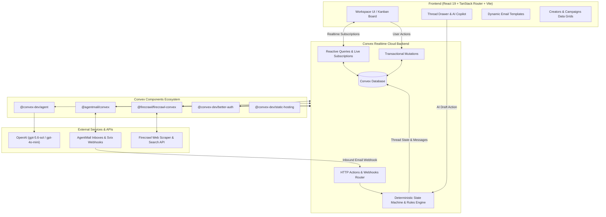

# Parley

> **Autonomous Creator Collaboration CRM & Sponsorship Negotiation Copilot**  
> Built for the **Convex All Gas Hackathon** using [Convex](https://convex.dev), React 19, TanStack Router, Tailwind CSS v4, and Radix UI.

[](https://convex.dev)
[](https://react.dev)
[](https://www.typescriptlang.org)
[](https://tailwindcss.com)
[](https://better-auth.com)
[](https://agentmail.to)
[](https://firecrawl.dev)

---

## Overview

Managing creator sponsorships and influencer collaborations is notoriously slow, chaotic, and manual. Partnership managers juggle dozens of fragmented email threads, spreadsheet trackers, media kits, rate negotiations, and onboarding contracts.

**Parley** is an autonomous creator partnership CRM that transforms sponsorship deal-making into a continuous, reactive pipeline:
- **Discovers and extracts creator intelligence** (metrics, reach, rates, past sponsors) automatically via **Firecrawl**.
- **Orchestrates autonomous email negotiations** over programmatic inboxes via **AgentMail**.
- **Enforces deterministic budget guardrails** using a 4-rule decision state machine (`Rule A/B/C/D`).
- **Assists human reviewers with an AI Copilot** powered by **OpenAI** (`gpt-5.6-sol` / `gpt-4o-mini`) to draft counter-offers, contracts, or polite declines in one click.
- **Renders a fluid ReUI Radix Kanban workspace** with live column metrics and drag-and-drop deal transitions.
- **Syncs everything in real-time** across browsers through **Convex** reactive subscriptions.

---

## System Architecture



---

## Key Features

### 1. Deterministic State Machine & Negotiation Rules Engine
Parley eliminates runaway AI hallucination by wrapping LLM comprehension in strict, deterministic mathematical guardrails:

| Rule | Scenario | Action | Pipeline Stage |
|---|---|---|---|
| **Rule A (Green Light)** | Creator rate $\le$ Campaign Budget Cap | Auto-accept or draft confirmation; generate onboarding contract link (`/onboard/...`). | `Accepted` |
| **Rule B (Counter-Offer)** | Creator rate $>$ Budget Cap but $\le 125\%$ | Draft counter-offer anchored strictly to the campaign budget cap ($2,000). Dispatches immediately in `full_autonomy` mode or holds for review in `human_in_the_loop` mode. | `Negotiating` |
| **Rule C (Hard Block)** | Creator rate $> 125\%$ of Budget Cap | Triggers human approval gate. Blocks automated dispatch until approved by a marketing manager. | `Review Required` |
| **Rule D (Decline / Ghosted)** | Explicit decline intent or inactivity $> 5$ days | Automatically marks the negotiation as declined or ghosted to keep pipeline velocity healthy. | `Declined / Ghosted` |

### 2. Interactive ReUI Radix Kanban Board
- **Fluid Drag-and-Drop**: Built using `@dnd-kit/core`, `@dnd-kit/sortable`, and Radix UI primitives for lag-free, accessible interaction.
- **6 Pipeline Columns**: `Discovered`, `Pitched`, `Negotiating`, `Review Required`, `Accepted`, `Declined / Ghosted`.
- **Live Metrics**: Each column header aggregates live deal counts and cumulative pipeline dollar value ($).
- **High-Density Deal Cards**: Shows creator avatars, platform icons, audience reach, agreed deliverables, proposed vs requested rates, sentiment scores, and rule pills.
- **Optimistic State Updates**: Card movement reflects instantaneously on the UI while syncing to the Convex database via `api.threads.moveStage`.

### 3. AI Email Copilot & Thread Drawer
- **Smart Contextual Drafting**: Powered by `draftEmailWithAgent` (`convex/agent.ts`) with deep context of campaign constraints, deliverables, and previous messages.
- **One-Click Command Chips**:
  - `Counter-offer $2,000` (anchors to budget cap)
  - `Accept & send onboarding contract` (generates agreement link)
  - `Ask for media kit & metrics` (requests audience demographics)
  - `Polite pass` (gracefully exits negotiation)
- **Closed-Loop Email Execution**: Sends outbound emails directly through `@agentmail/convex`. Inbound emails arrive through Svix-verified webhooks (`/agentmail/webhook`), triggering automatic re-analysis and stage progression.

### 4. Dynamic Email Templates with CodeMirror
- **Professional Code Editor**: Integrated `@uiw/react-codemirror` with `@codemirror/lang-html` and `@codemirror/theme-one-dark`.
- **Live Token Interpolation**: Insert dynamic placeholders at cursor position:
  - `{{creator.name}}`, `{{creator.handle}}`, `{{creator.rate}}`, `{{creator.platform}}`
  - `{{campaign.title}}`, `{{campaign.budget}}`, `{{campaign.deliverables}}`
  - `{{sender.name}}`, `{{sender.brand}}`
- **Full Route Architecture**: Dedicated URLs for listing (`/templates`), creating (`/templates/new`), and editing (`/templates/:id`).

### 5. Creator Discovery & Intelligence Scraper
- **Automated Web Scraping**: Ingests social media links and media kits via `@firecrawl/firecrawl-convex` and the official `@mendable/firecrawl-js` SDK.
- **Dossier Extraction**: Extracts follower counts, estimated rates, verified platforms, audience niche, brand fit scores, and past sponsors.
- **Discovery Modal**: Supports both bulk automated lead discovery and direct URL scraping.

### 6. Authentication & Protected Routes
- **Better Auth Integration**: Mounted `@convex-dev/better-auth` component with session cookie handling and credential auth.
- **Protected Route Guards**: Built on TanStack Router to ensure unauthenticated users cannot access sensitive CRM deal flow.
- **Sidebar Profile**: Persistent user account dropdown in the sidebar footer with quick profile info and sign out.

---

## Tech Stack

| Layer | Technology | Purpose |
|---|---|---|
| **Backend Platform** | [Convex](https://convex.dev) (`v1.45.0`) | Reactive document database, transactional mutations, edge functions, cron scheduling |
| **Frontend Framework** | [React 19](https://react.dev) + [Vite](https://vitejs.dev) | Next-generation React with strict typing and fast HMR |
| **Routing** | [TanStack Router](https://tanstack.com/router) | Fully type-safe client-side routing |
| **Styling & UI** | [Tailwind CSS v4](https://tailwindcss.com) + [Radix UI](https://www.radix-ui.com) | Neutral Claymorphism design system, accessible UI primitives |
| **Kanban & DnD** | `@dnd-kit/core` + `@dnd-kit/sortable` | Drag-and-drop column and card workspace |
| **Template Editor** | `@uiw/react-codemirror` | Syntax-highlighted HTML & token editor |
| **Authentication** | `@convex-dev/better-auth` | Convex-native session auth and user management |
| **Programmatic Mail** | `@agentmail/convex` + [AgentMail](https://agentmail.to) | Inbound/outbound email threads and webhook integration |
| **Web Scraping** | `@firecrawl/firecrawl-convex` + [Firecrawl](https://firecrawl.dev) | Web scraping, media kit analysis, and lead extraction |
| **AI / LLM** | `@convex-dev/agent` + [OpenAI](https://openai.com) | Autonomous negotiation reasoning (`gpt-5.6-sol`, `gpt-4o-mini`) |

---

## Project Structure

```text
├── convex/
│   ├── convex.config.ts          # Component registrations (agent, agentmail, firecrawl, betterAuth, staticHosting)
│   ├── schema.ts                 # Type-safe schema (campaigns, creators, threads, messages, emailTemplates)
│   ├── pipeline.ts               # Negotiation state machine, lead scraping, and demo seeding
│   ├── agent.ts                  # Autonomous agent logic and draftEmailWithAgent action
│   ├── email.ts                  # Durable AgentMail sending and inbox queries
│   ├── emailTemplates.ts         # Template CRUD, status toggles, and default template seeders
│   ├── firecrawl.ts              # Firecrawl client actions (Node runtime & component wrapper)
│   ├── http.ts                   # HTTP router mounting Better Auth, AgentMail Svix webhooks
│   ├── campaigns.ts              # Campaign management and metric aggregation queries
│   ├── creators.ts               # Creator database operations and profile updating
│   ├── threads.ts                # Thread stage transitions, approval gates, and message submission
│   ├── messages.ts               # Thread message persistence and intent logging
│   ├── auth.ts & auth.config.ts  # Better Auth configuration and adapters
│   └── integrations/
│       ├── openai.ts             # Deterministic rules evaluation and structured LLM extraction
│       ├── agentmail.ts          # AgentMail outbound delivery helpers
│       └── firecrawl.ts          # Firecrawl media kit analysis helpers
│
├── src/
│   ├── components/
│   │   ├── PipelineBoard.tsx     # ReUI Radix Kanban board with live deal cards
│   │   ├── ThreadDrawer.tsx      # Email thread timeline, AI Copilot chips, and email composer
│   │   ├── DashboardOverview.tsx # Executive dashboard with KPI metric cards
│   │   ├── ResearchModal.tsx     # Creator lead scraper & discovery modal
│   │   ├── app-sidebar.tsx       # Collapsible shadcn sidebar with persistent navigation
│   │   ├── nav-user.tsx          # Sidebar footer user profile and Better Auth sign-out
│   │   ├── ui/                   # Reusable UI primitives (kanban, neutral-card, sheet, dialog, etc.)
│   │   ├── crm/                  # Creators and Campaigns data grids with inline cell editing
│   │   ├── landing/              # Public marketing landing page components
│   │   └── templates/            # Dynamic email template management and CodeMirror editor
│   ├── pages/                    # Route pages (LandingPage, SignInPage, SignUpPage, TemplatePage)
│   ├── hooks/                    # Custom hooks (useTheme for dark/light mode toggle)
│   ├── lib/                      # Template interpolation engine and auth client
│   ├── routes/                   # TanStack Router configuration
│   ├── App.tsx                   # Main authenticated workspace view switcher
│   └── main.tsx                  # Root entrypoint with ConvexBetterAuthProvider and router tree
│
├── hackathon.md                  # Comprehensive evidence-based hackathon build log
└── package.json
```

---

## Getting Started

### 1. Prerequisites
- **Node.js**: `v20.x` or higher
- **Package Manager**: `pnpm` (recommended) or `npm`
- **Convex Account**: [convex.dev](https://convex.dev)

### 2. Clone and Install
```bash
git clone https://github.com/Abdssamie/Parley.git
cd Parley
pnpm install
```

### 3. Convex Setup
Initialize or connect your Convex project:
```bash
npx convex dev
```
This provisions your Convex backend, registers the required components, and generates the type-safe client APIs in `convex/_generated/`.

### 4. Environment Variables
Configure environment variables in your Convex deployment dashboard (or via `npx convex env set`):

```bash
# OpenAI Configuration (for AI Copilot and negotiation reasoning)
npx convex env set OPENAI_API_KEY "your-openai-api-key"
npx convex env set OPENAI_MODEL "gpt-4o-mini"

# Firecrawl Configuration (for web scraping and creator research)
npx convex env set FIRECRAWL_API_KEY "your-firecrawl-api-key"

# AgentMail Configuration (for programmatic inboxes and webhook dispatch)
npx convex env set AGENTMAIL_API_KEY "your-agentmail-api-key"

# Better Auth Secret (for secure session authentication)
npx convex env set BETTER_AUTH_SECRET "your-secure-random-secret"
```

For the frontend Vite client, create a `.env.local` file (automatically generated by `npx convex dev`):
```env
VITE_CONVEX_URL="https://your-deployment-name.convex.cloud"
```

### 5. Seed Showcase Data
Populate authentic showcase campaigns, creators, email templates, and active negotiations across all pipeline stages:

```bash
# Seed demo campaigns, creators, and multi-stage deal threads
npx convex run pipeline:seedDemoData

# Seed production email templates
npx convex run emailTemplates:seedDefaults
```

### 6. Run the Development Server
```bash
pnpm run dev
```
Open [http://localhost:5173](http://localhost:5173) in your browser.

---

## Seeding & Testing the Negotiation Loop

1. **Sign In**: Navigate to `/sign-in` and click **Demo Login** (or create an account).
2. **Explore the Pipeline**: Click **Pipeline** in the sidebar to view the ReUI Radix Kanban board with active deals.
3. **Inspect Deal Cards**:
   - **Rule A (Elena Rostova)**: Rate was $\le \$2,000$ $\rightarrow$ automatically moved to `Accepted` with a generated onboarding contract link.
   - **Rule B (Jack Roberts)**: Rate was $\$2,200$ (within 125%) $\rightarrow$ autonomous counter-offer anchored to $\$2,000$ dispatched in `Negotiating`.
   - **Rule C (Alex Rivera)**: Rate was $\$2,500$ ($> 125\%$) $\rightarrow$ flagged for human approval gate in `Review Required`.
   - **Rule D (DevBro)**: Creator declined $\rightarrow$ moved to `Declined`.
4. **Test the AI Copilot**:
   - Click any deal card to open the **Thread Drawer**.
   - Click the preset prompt chip **"Counter-offer $2,000"** or type a custom command.
   - Watch the agent draft a contextual email response in seconds.
   - Click **Send Email via AgentMail** to execute.
5. **Dynamic Template Editor**:
   - Navigate to **Templates** in the sidebar.
   - Open any template or create a new one to test the **CodeMirror** editor, syntax highlighting, and cursor-position variable insertion.

---

## License

This project was created for the Convex All Gas Hackathon and is open source under the [MIT License](LICENSE).
